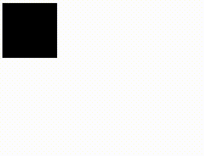
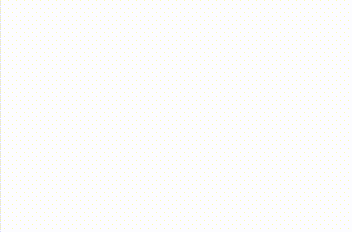
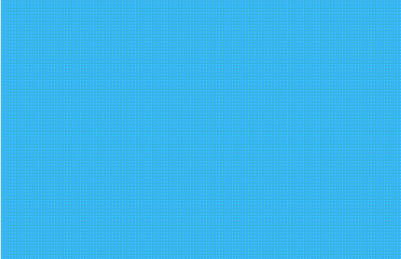
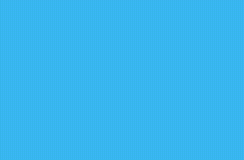
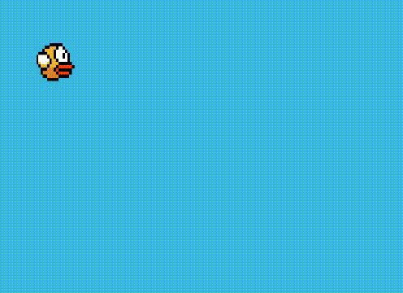

Este es un artículo escrito para personas: curiosas, entusiastas, inquietas que quieran aprender
y crear cosas interesantes para el mundo.

Hoy en día las tecnologías web no son lo que eran en la década pasada ya que las web tanto en el lado del cliente como del servidor han despegado y evolucionado a niveles estratosféricos y todo el mundo quiere estar al borde de dicha evolución las tecnologías a las que me refiero son: Html5, Css3, **Javascript/cliente/servidor**.

Específicamente es este post hablaré de las tecnologías del lado de cliente y una funcionalidad en particular que llamada canvas que viene como parte del estándar html en su versión 5.

## ¿Qué es HTML?

Html es un acrónimo que significa: 

HyperText - "Hipertexto"

Markup    -  "Marcado"

Language  -  "Lenguaje"

Es un lenguaje de marcado de hipertexto ¿ que significa esto ? es un lenguaje “estándar" creado para la elaboración de páginas web mediante un sistema de etiquetas especifica que una vez analizado y entendido por el navegador que estés usando, muestra todo el contenido de las páginas web: texto, imágenes, videos etc... la última versión de este lenguaje es la 5.

¿Que es canvas?
En español significa lienzo, es una etiqueta de html5 que aporta capacidades para desarrollar en 2d y 3d cosas como interfaces multimedia, animaciones, videojuegos y mucho mas con todo el poder de los navegadores y dispositivos modernos, se podría decir que es el reemplazo de Adobe Flash. ¿Qué te parece si iniciamos con algunos ejemplos?

##  ¿Demos de canvas?
Por supuesto que tengo ejemplos para explicarte de manera fácil y gráfica:
* [Canvas-Examples](http://designinstruct.com/web-design/examples-html5-canvas/) - Ejemplos de canvas
* [Canvas-Games 2d](http://www.lessmilk.com/12games) - Juegos en 2d 
* [Canvas-Games 3d](http://threejs.org/) - Juegos en 3d !!! 

Entonces comencemos a codear !!!
Vamos a hacer muchas cosas interesantes de aquí en adelante asi que necesitare toda tu concentración, recomiendo que cierres la pestaña del facebook por ahora, para comenzar necesitaremos las siguientes herramientas:

 * Editor de texto preferido yo recomiendo [sublime text 2](sublimetext.com/2) 
 * Navegador google chrome o mozilla firefox
 * Conocimiento básico de html5 y javascript
 *Café colombiano 

¿ No tengo conocimientos de html5 y javascript ?
No te preocupes dejaré algunos enlaces en los cuales podrás aprender de manera muy fácil los conocimientos básicos:

[Tuturiales en español de html5](https://www.youtube.com/watch?v=_93kDSPlKIM&list=PLC3F56FCF3C62F4A5)

[Introduccion a javascript](http://slides.com/esneyderaminpalaciosmena/intruccion-a-javascript#/13)
  
[Guia de javascript/Mozilla foundation](https://developer.mozilla.org/en-US/docs/Web/JavaScript/Guide/Values,_variables,_and_literals)

## Animación en canvas 1
En nuestra primera animación, simplemente dibujaremos un círculo y harémos que se mueva de izquierda a derecha, necesitaremos crear un documentos básico en html con la etiqueta canvas que tenga un identificador "lienzo" un ancho y un alto de 500 pixeles, también un enlace a el archivo de javascript con la etiqueta script y en el atributo ´src´ incluye la ruta del archivo que llamaremos **game.js** por ahora crea todos los archivos en la misma carpeta para no enredarnos con rutas relativas.



  <!DOCTYPE html>
  <html lang="es">
    <head>
    <meta charset="UTF-8">
    <title>Document</title>
    </head>
  <body>
    <canvas id="lienzo" width="500" height="500">
    Tu navegador no soporta algunas capacidades de esta página por favor actualizalo para tener una experiencia completa
    </canvas>
    
  </body>
  </html>


La etiqueta Canvas actualmente es **bastante soportada** por muchos **navegadores modernos**, sin embargo puede que el usuario quiera abrir "nuestra página" en un navegador muy antiguo en ese caso se le mostrará el mensaje que le indica que actualice su navegador, por el momento en la etiqueta canvas no irá nada.

En el documento de javascript escribiremos el siguiente código:


  var canvas = document.getElementById("lienzo");// seleccionamos y cacheamos la etiqueta canvas por medio de su identificador y lo guardamos en una variable que llamaremos canvas

  var ctx = canvas.getContext("2d");// Obtenemos el contexto en el que queremos dibujar en este caso es en 2d y lo guardamos en la variable ctx 


esta parte es muy importante ya que es por medio de estas variables que podremos hacer toda nuestra animación, canvas tiene la característica de poder dibujar cosas en sí misma, recuerda que es como un lienzo en cual podemos dibujar para hacer eso tiene varios métodos "funciones", los cuales podemos utilizar si quieres verlos todos puedes hacer lo siguiente:


  console.log(ctx); 


Si envias esa variable a la consola podras ver un objeto JSON en el cual se aprecian todos lo metodos de dibujo en 2d que estan definidos en el prototipo, o puedes ver la referencia aqui: [Mozilla/CanvasRendering2D](https://developer.mozilla.org/en-US/docs/Web/API/CanvasRenderingContext2D
)
Resulta que canvas implementa el sistema del eje de coordenadas para ubicar los elementos dibujados es importante tenerlo en mente, para ilustrar lo bien te vamos a dibujar una grilla sobre el lienzo para hacer eso haremos lo  siguiente:


var Grilla = function(){
var padding = 50;

 for( var colum = 1; colum < canvas.width/padding ;colum++ ){
    ctx.beginPath();// Indicamos que vamos a comenzar un dibujo
    ctx.moveTo( colum*padding, 0);//movemos el lapiz al punto necesario
    ctx.strokeStyle = "rgba(0,0,0,0.5)";//modificamos un el color de la línea
    ctx.lineTo( colum*padding,canvas.height); // llevamos el trazo hasta las coordenadas necesaria en y
    ctx.stroke();// trazamos el camino
    ctx.closePath();// Indicamos que terminamos el dibujo
 };//dibuja las columnas 

for( var rows = 1; rows < canvas.height/padding ;rows++ ){
    ctx.beginPath();// Indicamos que vamos a comenzar un dibujo
    ctx.moveTo( 0,rows*padding);//movemos el lapiz al punto necesario 
    ctx.strokeStyle = "rgba(0,0,0,1)";//modificamos un el color de la linea
    ctx.lineTo(canvas.width,rows*padding);// llevamos el trazo hasta las coordenadas necesaria en y
    ctx.stroke();// trazamos el camino 
    ctx.closePath();// Indicamos que terminamos el dibujo
 };//dibuja las filas

};//termina funcion que dibuja la malla sobre el canvas

Grilla();//llama a la funcion grilla 

Si invocas esta funcion **Grilla** tal vez veas algo como esto:

Analisemos el codigo, primero creamos una funcion a la cual llamamos **Grilla** esta funcion es muy importante por que la vamos a utilizar mas adelante entonces con los metodos de dibujo de lineas simples [moveTo](http://www.w3schools.com/tags/playcanvas.asp?filename=playcanvas_movetox) 
comenzamos a dibujar dentro de un ciclo las columnas y los mismo para las filas, analisemos mas de cerca.


  var padding = 25;//Espacio entre cada linea

Creamos una variable **padding** la cual guarda un valor fijo que va ser el espacio entre cada línea de nuestra grilla.


  canvas.width/padding

Para saber cuantas lineas tenemos que hacer para dibujar bien nuestra grilla simplemente dividimos el ancho en el caso de las columnas por el **padding** o espacio entre cada línea, este será el tope del ciclo que dibuja las líneas.


  ctx.beginPath();// Indicamos que vamos a comenzar un dibujo
  ctx.moveTo( colum*padding, 0);//movemos el lapiz al punto necesario

En cada iteracion comenzamos un dibujo con el metodo del contexto de canvas [beginPath](http://www.w3schools.com/tags/canvas_beginpath.asp) y movemos el **lapiz"** en el caso de las columnas en eje **X** multiplicando la variable de incremento por el **padding** o espacio entre cada línea esto va hacer que no dibujamos siempre el mismo lugar, mismo hacemos para las filas pero en eje ****Y**.


    ctx.strokeStyle = "rgba(0,0,0,0.5)";//modificamos un el color de la linea
    ctx.lineTo( colum*padding,canvas.height); // llevamos el trazo hasta las coordenadas necesaria en y
    ctx.stroke();// trazamos el camino
    ctx.closePath();// Indicamos que terminamos el dibujo

le cambiamos el color de la linea con el metodo [strokeStyle](http://www.w3schools.com/tags/canvas_strokestyle.asp) pero esto es opcional, recuerda que anteriomente movimos el "lapiz" con **moveTo** entonces ahora tenemos que decirle hasta qué punto queremos que haga el trazo de la línea con **lineTo** este método requiere 2 parámetros el primero es la posición en **X** de la línea y el segundo es la posición en **Y** entonces lo que nos interesa en el caso de las columnas es trazar hacia abajo hasta el ancho del canvas **canvas.height** lo mismo hacemos para las filas pero cambiando el alto del canvas por el ancho y terminamos cerrando la ruta  de la línea con **closePath**

Ahora simplemente dibujaremos un cuadrado relleno con **fillRect**, este método recibe cuatro parámetros los dos primeros son las coordenadas **X,Y** respectivamente, los otros dos son el ancho y el alto del cuadrado y las otras funciones **beginPath** y **closePath** sirven para no generar conflictos con otros dibujos futuros, es importante que vayan el este orden.


  Grilla();//invocamos la funcion que dibuja la grilla
  ctx.beginPath();// Comienza a trazar
  ctx.fillRect(0,0,100,100);// Dibuja un cuadrado 
  ctx.closePath();// Termina el trazo


Ahora hagamos que se mueva para hacer eso utilizaremos un funcion del lenguaje llamada [setInterval](https://developer.mozilla.org/en-US/docs/Web/API/WindowTimers.setInterval) esto ejecuta un bloque codigo cada cierto intervalo de tiempo y esta formada de una funcion anonima "callback" y como segundo parametro la cantidad de tiempo en milisegundos que queremos que se ejecute el bloque de codigo, entre caso pondremos 1000/25 que significa que nuestro bloque de codigo se ejecutara 25 veces por segundo, a este intervalo lo guardaremos en una variable llamada animacion. 


  var animacion = setInterval(function(){
      Grilla();//invocamos la funcion que dibuja la grilla
      ctx.beginPath();// Comienza a trazar
      ctx.fillRect(0,0,100,100);// Dibuja un cuadrado 
      ctx.closePath();// Termina el trazo
  },1000/25);


Si ejecutas el codigo ahora no veras ningun cambio aparente pero en realidad se está dibujando  25 veces cada segundo el cuadrado, entonces para hacer que se mueva necesitemos algo que aumente el valor de la coordenada en **X**, simplemente creamos una variable **moveX** que iremos aumentando dentro del nuestro intervalo "animación"


  var moveX = 0;// Creamos la variable que va a mover nuestro cuadrado
  var animacion = setInterval(function(){
      Grilla();//invocamos la funcion que dibuja la grilla
      ctx.beginPath();// Comienza a trazar
      ctx.fillRect(moveX,0,100,100);// Dibuja un cuadrado 
      ctx.closePath();// Termina el trazo
        moveX++
  },1000/25);

Si ejecutas el codigo tal vez veas algo como esto:

Nuestro cuadrado se comporta de manera extraña, esto es porque canvas funciona en las pantallas de televisión y cuando se hace un cambio como dibujar un rectángulo antes de mostrar lo debemos limpiar nuestro canvas, ¿como que limpiarlo? si limpiarlo mediante otro metodo llamado [clearRect](https://developer.mozilla.org/en-US/docs/Web/API/CanvasRenderingContext2D.clearRect) para lograr la ilusion de movimiento, este metodo puede mirarlo como un goma de borrar, esto realmente borra una parte del canvas pero lo que nos interesa es borrar todo el canvas para dibujar la nueva posicion de nuestro cuadrado u otros dibujo que haremos mas adelante.

**clearRect** recibe cuatro parámetros los dos primeros son las posiciones en **x y** donde queremos comenzar a borrar y los otros dos parámetros son el ancho y el alto de la "goma de borrar" 


  var moveX = 0;
  var animacion = setInterval(function(){
      ctx.clearRect(0,0,canvas.width,canvas.height);//borra el canvas antes de dibujar 
      Grilla();//invocamos la funcion que dibuja la grilla     
      ctx.beginPath();// Comienza a trazar
      ctx.fillRect(moveX,0,100,100);// Dibuja un cuadrado 
      ctx.closePath();// Termina el trazo
        moveX++
  },1000/25);


Con esto deberías ver algo como esto:

Puedes analizar el código completo de esta pequeña animacion aqui:

[Animacion de un cuadrado](http://jsfiddle.net/ymwq9anc/)

## Animación en canvas 2
Para este punto ya tenemos una idea más o menos de como funciona canvas, ahora hagamos cosas más interesantes con este mismo código, recuerdas las funciones de seno y cosenos que creíste nunca usarías en tu vida practica, pues resulta que son bastante útiles aquí para esta segunda animación vamos hacer que el cuadrado oscila en su movimiento de izquierda a derecha.

¿Por qué necesitamos en seno y el coseno?
Te lo voy explicar con un ejemplo miremos a cuanto equivale el seno de estos número:

|  Sen  | Resultado|  
|-------|----------|    
|  1    | 0.841... |
|  2    | 0.909... |
|  3    | 0.141... |
|  4    |-0.756... |
|  5    |-0.958... |
|  6    |-0.279... |
|  7    | 0.656... |
|  8    | 0.989... |
|  9    | 0.412... |
|  10   | 0.412... |

Como podemos ver cada algunos números son negativos y otros positivos esto es igual con la función coseno con la diferencia que el coseno comienza en negativo, este comportamiento se va a repetir una y otra vez. 

¿Como aplicamos esto?
Recuerda que canvas ubica los elementos con el eje de coordenadas "x,y" entonces aprovechamos esto para mover nuestro cuadrado a veces a la izquierda y a veces a la derecha,veamos esto en código.


  var canvas = document.getElementById("lienzo");// seleccionamos y cacheamos la etiqueta canvas por medio de su identificador y lo guardamos en una variable que llamaremos canvas

  var ctx = canvas.getContext("2d");// Obtenemos el contexto en el que queremos dibujar en este caso es en 2d y lo guardamos en la variable ctx 
  var moveX = 0;
  var animacion = setInterval(function(){
      ctx.clearRect(0,0,canvas.width,canvas.height);
      Grilla();//invocamos la funcion que dibuja la grilla
      ctx.beginPath();// Comienza a trazar
      ctx.fillRect( Math.sin(moveX)*200,0,100,100);// Dibuja un cuadrado 
      ctx.closePath();// Termina el trazo
      moveX+= 0.1
  },1000/25);


Si ejecutas el codigo ahora veras como esto:

Analisemos un poco el codigo el metodo: [Math](https://developer.mozilla.org/es/docs/Web/JavaScript/Referencia/Objetos_globales/Math) de javascript es el paquete de funciones matematicas que tiene el lenguaje una de esas es el seno ´sin´ la cual utilizamos para sacar el seno de **moveX** que va aumentando en **0.1** y recuerda estos valores oscilan entre positivo y negativo, entonces la posición del cuadrado en x también oscilará entre valores positivos y negativos y lo multiplicamos por **200** porque por ejemplo el seno de 1 es un número decimal muy pequeño entonces hay que elevarlo un poco para que se vea bien el movimiento si quieres puede jugar con este valor y notaras distintos comportamientos en el rango de movimiento 

 nota que canvas tambien acepta valores negativos sin ningun problema igual que el eje de coordenadas. 

¿Porqué se aumenta en 0.1 moveX?

Eso es para hacer la animación más fluida por ejemplo: 

|  Sen  | Resultado|  
|-------|----------|      
|  1    | 0.841... |
|  0.1  | 0.099... |

el seno de **0.1** es más pequeño que el de **1** y así sucesivamente a medida que va aumentando la variable **moveX** y esto en el eje de coordenadas ubica el elemento con una interpolación de movimiento más fluida si le pones un valor como uno a **moveX** entonces notarás que el elemento va ha dar uno saltos que hacen la animacion un poco rara.   
si quieres que el cuadrado no se salga de la ventana del navegador entonces puedes sumarle un número la la ecuación del seno que teníamos antes:


  ctx.fillRect(200+Math.sin(moveX)*200,0,100,100);// Dibuja un cuadrado 


Puedes ver el codigo en vivo aqui:

[Rect_oscila](http://jsfiddle.net/jb782xfm/)

## Animación en canvas 3
En esta animación vamos a utilizar la **funcion del seno** de manera espectacular, primero voy a explicarte el metodo rotacion de objetos en canvas [rotate](http://www.w3schools.com/tags/tryit.asp?filename=tryhtml5_canvas_rotate) este metodo rota el contexto de algun objeto en nuestro canvas como un cuadrado y resive como paramtro una ecuacion matematica para convertir de radianes a grados el angulo de en cual queremos rotar el cuadrado esta ecuacion es la siguiente:


  Grilla();//invocamos la funcion que dibuja la grilla
  var angulo = 45;//Angulo de rotacion 
  ctx.beginPath();//Comienza el trazo
  ctx.rotate(angulo*Math.PI/180);//rota el contexto del cuadrado
  ctx.fillRect(100,0,100,100);// Dibuja un cuadrado 
  ctx.closePath();//Termina el trazo

Para que funcione bien es importante que primero rotes el contexto con el método **rotate** antes de dibujar el cuadrado.

Cuando usamos este método lo que hace es que rota todo el contexto de dibujo para los elementos que se dibujen después de declarada esta instrucción a menos que cerremos la ruta del trazo con **closePath** u otras técnicas como guardar el contexto antes de rotar con **save** y luego restaurar lo con **restore** pero por ahora no nos interesa eso.

Si juegas con los valores de la variable **angulo** podrás observar que parece estar rotando de maneras extrañas esto es porque el contexto del cuadrado se esta rotando desde el punto **0,0** del canvas es decir el origen para solucionar esto lo que hacemos es usar otro método para trasladar el contexto del cuadrado **translate** , con este método podemos hacer lo siguiente:


  Grilla();//invocamos la funcion que dibuja la grilla
  var angulo = 45;//Angulo de rotacion 
  ctx.beginPath();//Comienza el trazo
  ctx.translate(100,100);//transladamos el contexto del cuadrado
  ctx.rotate(angulo*Math.PI/180);//rota el contexto del cuadrado
  ctx.fillRect(100,0,100,100);// Dibuja un cuadrado 
  ctx.closePath();//Termina el trazo

trasladamos el contexto del cuadrado a las coordenadas **100,100** si cambias el valor de la variable **angulo** no notaras mucha diferencia, recuerdas que el método **fillRect** crea un rectángulo teniendo como base unas coordenadas y un alto, ancho entonces para hacer que el pivote del cuadrado no sea el punto desde el cual nuestro cuadrado rote de forma extrañas, hacemos que el pivote este justo en el centro de la siguiente manera.


  Grilla();//invocamos la funcion que dibuja la grilla
  var angulo = 45;//Angulo de rotacion 
  ctx.beginPath();//Comienza el trazo
  ctx.translate(100,100);//transladamos el contexto del cuadrado
  ctx.rotate(angulo*Math.PI/180);//rota el contexto del cuadrado
  ctx.fillRect(-100/2,-100/2,100,100);// Dibuja un cuadrado 
  ctx.closePath();//Termina el trazo

si juegas con el ángulo de rotación veras que ya no se desplaza de manera extraña pero por qué ?

esto es porque es esta línea: 


  ctx.fillRect(-100/2,-100/2,100,100);// Dibuja un cuadrado 

cambiamos el origen desde el cual se va a dibujar nuestro canvas, recuerda que canvas también acepta números negativos, entonces en el eje **X** simplemente cambiamos la orientación dividiendo el ancho entre 2 y en el eje **Y** hicimos lo mismo pero con el alto, esta es la fórmula para encontrar el punto exacto de la mitad de un cuadrado, y lo volvimos negativo porque como trasladamos el contexto a la coordenada **100,100** lo puntos negativos menores a **100** son visibles dentro de canvas, esto puede ser un poco confuso pero aseguro que si juegas con los números podrás llegar a entenderlo y dominarlo.

Por ejemplo si comenzamos a dibujar desde las coordenadas **0,0** en este contexto realmente observamos como se si estuviera dibujando en la coordenadas **100,100** de un contexto normal


  ctx.fillRect(0,0,100,100);// Dibuja un cuadrado 


Con esto en mente hagamos que rote dentro de una animación:


var angulo = 45;//Angulo de rotacion 
var Play = setInterval(function(){
  canvas.width = canvas.width;//limpia el canvas
  Grilla();
  ctx.beginPath();//Comienza el trazo
  ctx.translate(100,100);//transladamos el contexto del cuadrado
  ctx.rotate(angulo*Math.PI/180);//rota el contexto del cuadrado
  ctx.fillRect(-100/2,-100/2,100,100);// Dibuja un cuadrado 
  ctx.closePath();//Termina el trazo
  angulo += 2;
},1000/25);


Si todo te funciono bien tal vez veas algo como esto:

Simplemente creamos un **setInterval** corre a 25 fotogramas por segundo y vamos aumentando el ángulo de rotación por un factor de 2.

puedes ver el código completo aqui:

[rect_rotate](http://jsfiddle.net/wsnn3pc3/)

###Juguemos con las matemáticas !!!

Que pasaria si rotamos el cuadrado con el seno del ángulo:


 ctx.rotate(( Math.sin(angulo)*50 )*Math.PI/180);//rota el contexto del cuadrado

Con esto aprovechamos la propiedad del seno que a veces es negativo y a veces positivo y hacemos que rote hacia la derecha o hacia la izquierda y lo multiplicamos por **50** porque el seno es un número decimal muy pequeño, ahora en vez de aumentar el ángulo en un factor de **2** lo hacemos con **0.2** para que la animación se vea más fluida


 angulo += 0.2;

Si todo funciona bien tal vez veas algo como esto:

## Animación en canvas 4

Para este punto necesito que tengas muy en claro los conceptos de rotación y traslación que utilizamos en la animación anterior, vamos hacer el efecto de látigo muy popular en las animaciones de **flash** entonces simplemente re utilizamos el código anterior  


var angulo = 45;//Angulo de rotacion 
var Play = setInterval(function(){
  canvas.width = canvas.width;//limpia el canvas
  Grilla();
  ctx.beginPath();//Comienza el trazo
  ctx.translate(100,100);//transladamos el contexto del cuadrado
  ctx.rotate(( Math.sin(angulo)*50 )*Math.PI/180);//rota el contexto del cuadrado
  ctx.fillRect(0,0,25,25);// Dibuja un cuadrado 
  ctx.closePath();//Termina el trazo
  angulo += 0.25;
},1000/25);


Cambiamos el origen del cuadrado en este caso va hacer **0,0** en el contexto trasladado, si no entiendes eso te recomiendo que mires con más detalle la animación anterior, le cambiemos el aumento a el ángulo por **0.25**, hasta ahora no hay mucho cambio pero desde aquí comienza la magia así que muy atento/a


  ctx.beginPath();//Comienza el trazo
  ctx.translate(100,100);//transladamos el contexto del cuadrado
  ctx.rotate(( Math.sin(angulo)*50 )*Math.PI/180);//rota el contexto del cuadrado
  ctx.fillRect(0,0,25,25);// Dibuja un cuadrado 
  ctx.closePath();//Termina el trazo

  ctx.beginPath();//Comienza otro trazo
  ctx.translate(25,25);//transladamos el contexto del segundo cuadrado
  ctx.rotate(( Math.sin(angulo)*50 )*Math.PI/180);//rota el contexto del cuadrado
  ctx.fillStyle = "red";
  ctx.fillRect(0,0,25,25);// Dibuja un cuadrado 
  ctx.closePath();//Termina el trazo


Creamos otro cuadrado el cual tiene propiedades similares a el primero solo que como estamos en el contexto que rotamos anteriormente entonces dentro este contexto volvemos a trasladarlo 25 píxeles en **X,Y** ¿por qué? este es el ancho y el alto del primer cuadrado esto con el objetivo de que el objetivo de que el origen del segundo cuadrado sea el punto inferior derecho del primero y le cambiamos el color con **fillStyle** para que se vea mejor.

Con esto logramos un efecto interesante:

Ahora simplemente copiamos y pegamos para crear más cuadrados 


  ctx.beginPath();//Comienza el trazo
  ctx.translate(100,100);//transladamos el contexto del cuadrado
  ctx.rotate(( Math.sin(angulo)*50 )*Math.PI/180);//rota el contexto del cuadrado
  ctx.fillRect(0,0,25,25);// Dibuja un cuadrado 
  ctx.closePath();//Termina el trazo

  ctx.beginPath();//Comienza otro trazo
  ctx.translate(25,25);//transladamos el contexto del segundo cuadrado
  ctx.rotate(( Math.sin(angulo)*50 )*Math.PI/180);//rota el contexto del cuadrado
  ctx.fillStyle = "red";
  ctx.fillRect(0,0,25,25);// Dibuja un cuadrado 
  ctx.closePath();//Termina el trazo

  ctx.beginPath();//Comienza otro trazo
  ctx.translate(25,25);//transladamos el contexto del segundo cuadrado
  ctx.rotate(( Math.sin(angulo)*50 )*Math.PI/180);//rota el contexto del cuadrado
  ctx.fillStyle = "green";
  ctx.fillRect(0,0,25,25);// Dibuja un cuadrado 
  ctx.closePath();//Termina el trazo

  ctx.beginPath();//Comienza otro trazo
  ctx.translate(25,25);//transladamos el contexto del tercer cuadrado
  ctx.rotate(( Math.sin(angulo)*50 )*Math.PI/180);//rota el contexto del cuadrado
  ctx.fillStyle = "green";
  ctx.fillRect(0,0,25,25);// Dibuja un cuadrado 
  ctx.closePath();//Termina el trazo

  ctx.beginPath();//Comienza otro trazo
  ctx.translate(25,25);//transladamos el contexto del cuarto cuadrado
  ctx.rotate(( Math.sin(angulo)*50 )*Math.PI/180);//rota el contexto del cuadrado
  ctx.fillStyle = "yellow";
  ctx.fillRect(0,0,25,25);// Dibuja un cuadrado 
  ctx.closePath();//Termina el trazo 


Si todo funciona bien verás algo como esto:

puedes jugar con los valores y obtener resultados impresionantes como por ejemplo si modificas 
la linea


  ctx.rotate(( Math.sin(angulo)*90 )*Math.PI/180);//rota el contexto del cuadrado


Aumentando el número por el cual se va a multiplicar seno del ángulo de rotación por 90 en cada cuadrado veras algo como esto:

O si solo lo modificas este valor en el ultimo cuadrado obtendras esto:


  ctx.rotate(( Math.sin(angulo)*(50+35) )*Math.PI/180);//rota el contexto del cuadrado


si quieres puedes hacerlo mas lento o más rápido modificando el aumento del ángulo


  angulo += 0.095;//mas lento

O aumentar la velocidad con valor al azar 


  angulo += (Math.random()/8)*2;//valor azar 


Puedes lograr efectos raros modificando las variables que podrías aplicar de muchas formas en cosas como videojuegos, todo esta en tu creatividad. 

 Si logras algo interesante te agradeseria que me lo mostraras en enviado me un tweet a [Un man chevere](https://twitter.com/Sneyder_A) 

Puedes ver el codigo completo aqui:
[Rect_latigo_motion](http://jsfiddle.net/jfug7n7o/)

##Cinemáticas de flappy bird 

Ahora veremos como podemos emular la cinemática de un famoso juego **flppy bird** no voy ha hacer el juego completo porque sería muy largo tal vez en un post futuro lo haga pero vamos al grano, primero analisemo un poco de la cinematica del ave protagonista:

Te podrás imaginar que la función del seno será útil ahora el mismo código que teníamos anteriormente nos sirve, solo tenemos que cambiar la oscilación en el eje y:


var canvas = document.getElementById("lienzo");// seleccionamos y cacheamos la etiqueta canvas por medio de su identificador y lo guardamos en una variable que llamaremos canvas
canvas.style.background = "rgb(59, 183, 241)";
var ctx = canvas.getContext("2d");// Obtenemos el contexto en el que queremos dibujar en este caso es en 2d y lo guardamos en la variable ctx 
var moveX = 0;
var animacion = setInterval(function(){
    ctx.clearRect(0,0,canvas.width,canvas.height);
    ctx.beginPath();// Comienza a trazar
    ctx.fillRect(moveX*10,200+(Math.sin(moveX)*50),50,50);// Dibuja un cuadrado 
    ctx.closePath();// Termina el trazo
    moveX += 0.4;
},1000/25);


En el eje x tendremos **moveX*10** es para que se desplace de forma horizontal, cambia el aumento de **moveX** en **0.4** para que se mueva mas rapido nuestro elemento y para dar mas estetica cambia el color de fondo del canvas con **canvas.style.background ="rgb(59, 183, 241)";
**

tal vez vea algo como esto:

Por último lo que necesitamos reemplazar el cuadrado por una imagen de flappy canvas tiene la capacidad de hacer esto mediante un método llamado [drawImage](http://www.html5canvastutorials.com/tutorials/html5-canvas-images/) busca una imagen en internet de flappy  y hagamos lo siguiente:


var canvas = document.getElementById("lienzo");// seleccionamos y cacheamos la etiqueta canvas por medio de su identificador y lo guardamos en una variable que llamaremos canvas
canvas.style.background = "rgb(59, 183, 241)";

var ctx = canvas.getContext("2d");// Obtenemos el contexto en el que queremos dibujar en este caso es en 2d y lo guardamos en la variable ctx 
var flappy = new Image();//Creamos un nuevo objeto de la clase Image y lo instanciamos en la variable flappy

flappy.onload = function(){
  //Cuando la imagen carge comienza la animacion  
  var moveX = 0;
  var animacion = setInterval(function(){
      ctx.clearRect(0,0,canvas.width,canvas.height);
      ctx.beginPath();// Comienza a trazar
      ctx.drawImage(flappy,moveX*10,200+(Math.sin(moveX)*50),50,50);// Dibuja una imagen y le pasamos como primer parametro la imagen que acabo de cargar   
      ctx.closePath();// Termina el trazo
      moveX += 0.4;
  },1000/25);
};
flappy.src = "https://pbs.twimg.com/media/B00B0EoIcAAY6e6.png:large"; // le pasamos la ruta de la imagen 


lo primero que hacemos es crear un nuevo objeto imagen que instanciamos en la variable flappy esto es como si escribiéramos una **etiqueta imagen** ´´ en html desde **javascript** entonces cuando la imagen de flappy cargue en el evento [onload](http://www.w3schools.com/jsref/event_onload.asp) comienza nuestra animación, con el método [drawImage](http://www.html5canvastutorials.com/tutorials/html5-canvas-images/) reemplazamos el cuadrado por la imagen de flappy, nota que el primer parámetro que le pasamos a este método fue la imagen que creamos anterior, por ahora pega la imagen de flappy en la misma carpeta en donde esta el archivo de javascript, lo ideal sería que la imagen fuera con extensión png por que esta extensión acepta la transparencia de imágenes.  

Si todo funciona te funciona bien tal vez veas algo como esto:

Por último para gastar procesador de más entonces vamos a detener la animación ´setInterval´ con el método **clearInterval** de esta manera: 



var canvas = document.getElementById("lienzo");// seleccionamos y cacheamos la etiqueta canvas por medio de su identificador y lo guardamos en una variable que llamaremos canvas
canvas.style.background = "rgb(59, 183, 241)";

var ctx = canvas.getContext("2d");// Obtenemos el contexto en el que queremos dibujar en este caso es en 2d y lo guardamos en la variable ctx 
var flappy = new Image();//Creamos un nuevo objeto de la clase Image y lo instanciamos en la variable flappy

flappy.onload = function(){
  //Cuando la imagen carge comienza la animacion  
  var moveX = 0;
  var animacion = setInterval(function(){
      ctx.clearRect(0,0,canvas.width,canvas.height);
      ctx.beginPath();// Comienza a trazar
      ctx.drawImage(flappy,moveX*10,200+(Math.sin(moveX)*50),50,50);// Dibuja una imagen y le pasamos como primer parametro la imagen que acabo de cargar   
      ctx.closePath();// Termina el trazo
      moveX += 0.4;
      if( moveX*10+50 >= canvas.width ){
        clearInterval(animacion);
      };  
  },1000/25);
};
flappy.src = "https://pbs.twimg.com/media/B00B0EoIcAAY6e6.png:large"; // le pasamos la ruta de la imagen 


Cuando flappy llega al punto máximo en el eje x entonces detenemos la animación con ´       clearInterval(animacion)´ y le pasamos como parámetro el nombre del ´setInterval´ que contiene nuestra animación, o podemos hacer que que nuestra animación comience de nuevo regresando a la variable moveX que mueve a flappy a su valor original.



  if( moveX*10+50 >= canvas.width ){
    moveX = 0;
    //clearInterval(animacion);//detiene la animacion
  };  

 
Si todo esta bien tal vez veas algo como esto:

Puedes ver el código completo aqui:
[flappy_animation](http://jsfiddle.net/1tqaxmes/)

para los proximo post sobre canvas hablaremos de la como hacer video juegos con javascript orientado a objetos tal vez hagamos un clon de flappy bird o del clasico invasores del espacio gracias por tu atencion te agradeceria si lo compartes si aprendiste algo agradece con un tweet att: [Un man chevere](https://twitter.com/Sneyder_A)
att: [H4ckdo](https://twitter.com/H4ckdo)
att: [QuibdoJs](https://twitter.com/QuibdoJs)
